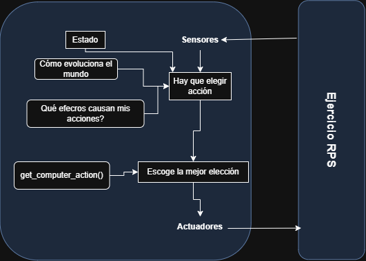

# RPS_SergioMendez

# Juego Piedra, Papel o Tijera

Este proyecto está basado en el juego "Piedra, Papel o Tijera". Este permite que un usuario compita contra la computadora en múltiples rondas. Al alcanzar las 6 rondas, la computadora intenta predecir las elecciones del usuario basándose en su historial de elecciones anteriores. El objetivo del proyecto es ofrecer el ocio de poder disputar un juego de la mejor manera posible contra un ordenador que actúa de manera inteligente

# 1. Especificación do contorna de tarefas

| **Contorno de tareas** | **Completamente/Parcialmente Observable** | **Agentes**    | **Determinista/Estocástico** | **Episódico/Secuencial** | **Estático/Dinámico** | **Discreto/Continuo** | **Conocido/Desconocido** |
|:----------------------:|:---------------------------------------:|:--------------:|:---------------------------:|:------------------------:|:---------------------:|:----------------------:|:-------------------------:|
| **RPS**                | Parcialmente                            | Multiagente     | Estocástico                 | Episódico                | Estático              | Discreto               | Conocido                  |

**Completamente/Parcialmente Observable:** Parcialmente, ya que el jugador ve su propia acción y la del ordenador, pero no sabe cómo la computadora predice que hará.

**Agentes:** 
Multiagente, en este caso serán el jugador y el ordenador, los cuáles jugarán el uno contra el otro.

**Determinista/Estocástico:** 
Estocástico, ya que el ordenador elegirá de manera aleatoria o basándose en el historial de rondas anteriores(en casos utilizando un randomizador de elección en estos casos).

**Episódico/Secuencial:** 
Episódico, cada ronda de juego será diferente y no afectará al resto.

**Estático/Dinámico:** 
Estático, ya que las reglas del juego no cambiarán de una ronda a otra.

**Discreto/Continuo:** 
Discreto, ya que sólo existen tres elecciones posibles en el juego.

**Conocido/Desconocido:** 
Conocido, ambos jugadores conoceran las reglas y el entorno del juego.

# 2. Identificación del tipo de agente y su  estructura

EL agente utilizado en el proyecto está basado en modelos. Con él nuestra máquina aprenderá y actuará en base a lo aprendido. Realmente no sé cómo direccionar exactamente cómo trabaja mi código y mostrarlo dentro de la imagen del propio modelo, ya que realmente la única función de nuestro modelo ocurre dentro del método get_computer_action(). Lo que se ha creado en este proyecto es lo que nos ayudará a elegir la acción. Sin embargo, esto no cambiará el estado, como evoluciona el resto o el efecto de las elecciones en el juego.

# 3. Cómo poder trabajar con este proyecto y jugar utilizando Windows

**Paso 1: Instalar Git**

Si aún no tienes Git instalado en tu sistema, debes instalarlo primero.

Ve a la página oficial de Git y descarga el instalador para Windows.

Ejecuta el instalador y sigue las instrucciones. Asegúrate de elegir las opciones predeterminadas, ya que son adecuadas para la mayoría de los usuarios.

**Paso 2: Clonar el repositorio en tu máquina**

Abre el "Anaconda Prompt" desde el menú de inicio o abre una terminal Conda dentro de VS Code.
Crear y activar el entorno virtual: Si no has creado el entorno Conda aún, ejecuta los siguientes comandos en la terminal:

conda create -n rps python=3.9

conda activate rps

Esto creará y activará el entorno Conda llamado rps.

En la terminal de Conda, navega al directorio donde deseas guardar el proyecto. Por ejemplo, si deseas guardarlo en tu carpeta Proyectos:

cd C:\Users\TuUsuario\Documents\Proyectos

Luego, clona el repositorio con el siguiente comando:

git clone https://github.com/sergiomenurt/RPS_SergioMendez.git

Este comando descargará el repositorio en una carpeta llamada RPS_SergioMendez dentro del directorio en el que te encuentras.

Navegar al proyecto clonado: Después de clonar el repositorio, entra en el directorio del proyecto:

cd RPS_SergioMendez

**Paso 3: Configurar el proyecto en VS Code**

Abre VS Code y selecciona "Archivo" > "Abrir carpeta" y selecciona la carpeta RPS_SergioMendez que acabas de clonar.

Si no lo has hecho ya, asegúrate de que VS Code esté utilizando el entorno Conda que creaste (el rps).

Para esto, ve a la parte inferior izquierda de VS Code, donde se muestra el nombre del intérprete de Python. Haz clic allí y selecciona el entorno rps (el que activaste anteriormente).

Para instalar las dependencias (si las hubiera), puedes usar el siguiente comando(en este proyecto no hará falta):

pip install -r requirements.txt

**Paso 4: Ejecutar el proyecto**

En la terminal integrada de VS Code, asegúrate de que el entorno Conda está activado (verás algo como rps).

Luego, ejecuta el archivo principal del proyecto RPS.py

python src\RPS.py

Esto ejecutará el juego de "Piedra, Papel o Tijeras", y podrás interactuar con él en la terminal.

**Paso 5: Jugar y modificar el código**

Una vez que el juego esté funcionando, puedes empezar a jugar contra la computadora.
Si deseas modificar el código, simplemente edita los archivos en el proyecto y vuelve a ejecutar el archivo principal.

# 4. Extensión ao RPS + Lizard Spock

EL juego se extiende al RPSLS cuando añadimos más opciones de elección a nuestro usuario y también a nuestro ordenador. Junto con ello añadiremos los casos tanto de victoria como de derrota que corresponde a lizard y spock.

Serán añadidos en el tests_RPS.py diferentes casos unitarios para los casos de derrota y victoria de ambos.

A la hora de jugar con nuestro proyecto. No habrá mayor problema que el conocimiento del juego(lo cual explicaré a continuación =).

# 5. ¿Cómo jugar al RPSLS?

Elige una opción: Tienes 5 opciones para elegir:Piedra, Papel, Tijeras, Lagarto o Spock.

Eligen al mismo tiempo ambos jugadores (tú y el computador) sin saber que elegirá el otro.

Las reglas del juego se basan en que cada elemento ganará o perderá contra otro. Los casos son los siguientes:

Piedra gana a Tijeras y Lagarto.
Papel gana a Piedra y Spock.
Tijeras gana a Papel y Lagarto.
Lagarto gana a Spock y Papel.
Spock gana a Tijeras y Piedra.

Ocurrirá un empate si ambos eligen la misma opción.

Al final de cada ronda se preguntará añ usuario si quiere volver a jugar una nueva ronde en base a responder y(yes) o n(no).

**Espero que lo hayas comprendido y hayas podido disfrutar de mi juego!**